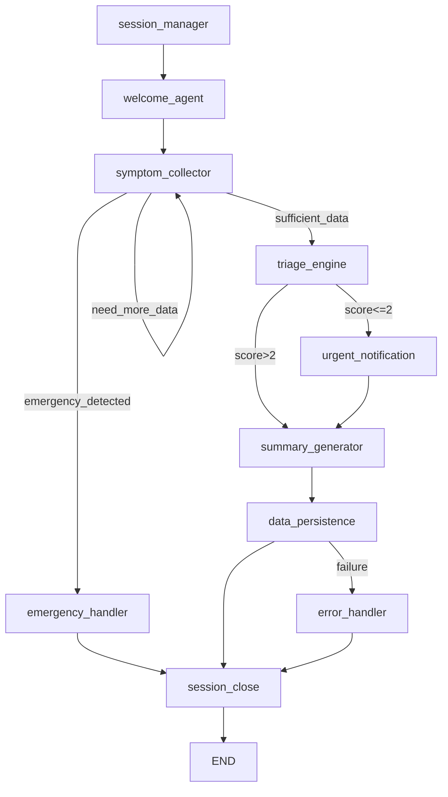

# synapse Hospital AI Assistant - Agent Architecture (MiniCPM5-1B Optimized)

> **Project**: synapse Hospital AI Assistant  
> **Model**: MiniCPM5-1B (1B parameters, local deployment)  
> **Design Principle**: *Model handles conversation flow and routing. All clinical logic is deterministic.*  
> **Version**: 2.0.0  
> **Last Updated**: 2024-06-04  

---

## Critical Design Constraints

MiniCPM5-1B is **1B parameters** and excels at **tool use, code generation, and agentic workflows**, but it is **NOT a medical reasoning model**. It can hallucinate and produces unsafe outputs in high-stakes settings.

### What the Model DOES Well
- Conversational turn-taking and patient engagement
- Intent classification (e.g., "this is an emergency" vs "this is a routine question")
- Entity extraction from patient messages (symptoms, durations, severity words)
- Structured output generation (JSON formatting)
- Tool calling and workflow routing
- Long-context conversation memory (131K tokens)

### What the Model DOES NOT Do Well
- Complex medical reasoning or diagnosis
- Risk assessment from ambiguous symptoms
- Interpreting subtle clinical presentations
- Making high-stakes triage decisions independently

### Our Response: Separation of Concerns

| Task | Handler | Reason |
|------|---------|--------|
| Patient conversation | **MiniCPM5-1B** | Natural language, context awareness |
| Symptom parsing | **Deterministic code + regex** | Reliable, testable, no hallucination |
| Emergency detection | **Keyword matcher + rules engine** | Must be 100% reliable, no LLM involvement |
| Triage scoring | **Clinical rules engine** | Based on hospital protocols, auditable |
| Department routing | **Decision tree + RAG lookup** | Deterministic, explainable |
| Clinical summaries | **Template engine + structured data** | Factual, not generated from scratch |
| Knowledge retrieval | **Vector DB + RAG** | Retrieved context, not hallucinated |

---

## System Overview

```yaml
name: "synapse Hospital AI Assistant"
version: "2.0.0"
environment: "local"

llm:
  provider: "local"
  model: "MiniCPM5-1B"
  temperature: 0.3        # Low temp for consistent routing
  max_tokens: 1024        # Keep responses short and focused
  enable_thinking: false  # Use fast mode for routing; enable only for complex parsing
  
  # MiniCPM5-1B uses XML-style tool calls via SGLang
  tool_call_format: "xml"
  recommended_backend: "SGLang"

observability:
  provider: "Langfuse"
  tracing: true
  metrics:
    - latency
    - token_usage
    - tool_call_accuracy
    - routing_errors

database:
  primary: "PostgreSQL"
  cache: "Redis"
  session_ttl: 3600

# Checkpointing: Resume after crash at last completed node
checkpointing:
  store: "PostgreSQL"           # LangGraph SqliteSaver/PostgresSaver
  save_interval: "per_node"   # After every node completion
  max_resume_age: 86400       # 24 hours — sessions older than this restart fresh

# Guardrails: All clinical outputs validated before reaching patient/clinician
validation_layer: "required"

# Resilience: Retry and recovery configuration
resilience:
  json_parse_retries: 1         # 1 retry for malformed MiniCPM5-1B JSON output
  tool_call_retries: 3          # 3 retries for transient tool/API failures
  tool_retry_backoff: "exponential"  # 1s, 2s, 4s max 8s
  tool_retry_max_delay: 8       # seconds
```

---

## State Schema

```python
class SessionState:
    session_id: str              # Redis key
    patient_id: str              # Anonymous or identified
    turn_count: int              # Prevent infinite loops (max: 20)
    
    # Conversation
    conversation_history: list   # Raw messages for context window
    
    # Extracted Data (populated by deterministic extractors)
    extracted_symptoms: list     # Structured: [{name, duration, severity, location}]
    extracted_entities: dict     # {medications, allergies, prior_conditions}
    
    # Safety Flags (set by rules engine, NEVER by LLM)
    emergency_detected: bool
    emergency_type: str          # "cardiac", "respiratory", "trauma", etc.
    
    # Triage (computed by clinical rules engine)
    triage_score: int            # 1-5, computed deterministically
    triage_justification: str    # Which rules fired
    recommended_department: str  # From routing table
    
    # RAG
    retrieved_context: list      # Hospital protocols retrieved
    
    # Output
    patient_facing_message: str # What the patient sees
    clinician_summary: dict      # Structured data for dashboard
    
    # Checkpointing
    last_checkpoint_node: str     # Which node completed last (for resume)
    last_checkpoint_time: datetime  # When checkpoint was saved
    resume_count: int            # How many times this session resumed

    # Metadata
    source: str                  # kiosk, web, mobile, reception
    language: str
    timestamp: datetime
```

---

## Resilience & Checkpointing

### Per-Node Checkpointing

LangGraph persists `SessionState` to PostgreSQL after **every node completion**. If the server crashes, the session resumes from the last completed node — not from the beginning.

```python
def checkpoint_state(state, current_node):
    state.last_checkpoint_node = current_node
    state.last_checkpoint_time = datetime.utcnow()
    postgres.save_checkpoint(
        session_id=state.session_id,
        state=state,
        node=current_node
    )
    return state
```

**Resume Logic:**
```python
def resume_session(session_id):
    checkpoint = postgres.load_checkpoint(session_id)
    if not checkpoint:
        return None  # New session
    
    age = datetime.utcnow() - checkpoint.last_checkpoint_time
    if age.total_seconds() > 86400:  # 24 hours
        return None  # Too old — restart fresh
    
    state = checkpoint.state
    state.resume_count += 1
    return state, state.last_checkpoint_node  # Resume here
```

**Nodes that checkpoint:**
- `session_manager` → after initialization
- `welcome_agent` → after welcome message sent
- `symptom_collector` → after each turn (patient message + LLM response)
- `triage_engine` → after triage score computed
- `summary_generator` → after patient message generated
- `data_persistence` → after data saved
- `session_close` → after closing message sent

**What survives a crash:**
- All extracted symptoms and entities
- Conversation history
- Triage score and justifications
- Emergency flags
- Turn count

**What does NOT survive (acceptable):**
- In-flight LLM generation (patient sees "Loading..." and retries)
- Uncommitted tool calls (harness retries automatically)

---

### JSON Validation + Retry

MiniCPM5-1B (1B params) occasionally outputs malformed JSON. The harness validates before acting.

```python
def parse_llm_json(raw_output, retry_count=0):
    try:
        return json.loads(raw_output)
    except json.JSONDecodeError:
        if retry_count < 1:  # 1 retry max
            # Re-prompt with explicit JSON reminder
            corrected = llm.reprompt_with_reminder(
                original_prompt,
                error="Invalid JSON. Respond with valid JSON only."
            )
            return parse_llm_json(corrected, retry_count + 1)
        else:
            # Fallback: use deterministic template
            return generate_fallback_response()
```

**Validation Rules:**
- JSON must be parseable
- Required fields must be present (`message`, `next_action`, etc.)
- No medical advice keywords in `message` field
- `triage_score` must NOT appear in patient-facing output

**On persistent failure:**
- Log to Langfuse as `json_parse_failure`
- Return static fallback message
- Trigger `error_handler` → human handoff

---

### Tool Call Retry with Backoff

Transient failures (API timeouts, rate limits, DB connection drops) are retried automatically before surfacing to the patient.

```python
def execute_with_retry(tool_call, max_retries=3):
    delay = 1  # seconds
    for attempt in range(max_retries):
        try:
            result = tool_call.execute()
            return {"status": "success", "result": result}
        except TransientError as e:
            if attempt < max_retries - 1:
                time.sleep(min(delay, 8))  # cap at 8s
                delay *= 2  # exponential backoff: 1s, 2s, 4s
            else:
                return {
                    "status": "error",
                    "error": str(e),
                    "retries_exhausted": True
                }
```

**Retry Behavior by Error Type:**

| Error Type | Retry? | Backoff | Max Wait | Fallback |
|------------|--------|---------|----------|----------|
| HTTP 429 (rate limit) | ✅ Yes | Exponential | 8s | Cached data |
| HTTP 503 (service unavailable) | ✅ Yes | Exponential | 8s | Retry message |
| HTTP 404 (not found) | ❌ No | — | — | Return error |
| DB connection timeout | ✅ Yes | Exponential | 8s | Use Redis cache |
| LLM backend timeout | ✅ Yes | Fixed 2s | 6s | Static template |
| Invalid tool params | ❌ No | — | — | Return validation error |

**Patient never sees retries.** The harness holds the conversation while retrying. If all retries fail, the harness returns a graceful fallback (e.g., "Let me connect you with staff") rather than an error code.

---

## Agent Nodes

### 1. Session Manager (Deterministic)

**ID**: `session_manager`  
**Type**: Entry Node  
**Handler**: Python code (NOT LLM)  

**Purpose**: Initialize session, load patient record, set safety defaults.

```python
def session_manager(state):
    # All deterministic - no LLM involved
    state.session_id = generate_uuid()
    state.turn_count = 0
    state.emergency_detected = False
    
    if state.patient_id:
        record = postgres.lookup_patient(state.patient_id)
        state.extracted_entities = record.demographics
    
    return state, "route_to_welcome"
```

**Transitions**:
- Always → `welcome_agent`

---

### 2. Welcome Agent (MiniCPM5-1B)

**ID**: `welcome_agent`  
**Type**: LLM Node  
**Purpose**: Greet patient, explain system, collect initial concern.

**Why LLM**: Requires natural language generation and contextual awareness.

**Prompt Template** (MiniCPM5-1B optimized - short, structured):

```
You are synapse, a hospital triage assistant. Your job is to welcome the patient 
and ask what brings them in today. Be warm, brief, and clear.

Rules:
- Do NOT diagnose
- Do NOT give medical advice
- Do NOT mention specific departments yet
- If the patient mentions severe symptoms, ask clarifying questions

Patient: {{patient_name}}
Language: {{language}}

Respond with a JSON object:
{
  "message": "Your welcome message here",
  "next_action": "ask_symptoms"
}
```

**Tools Available** (Progressive Disclosure — 3 of 15):
- `end_conversation` — Patient wants to stop
- `request_human` — Patient asks for a human
- `switch_language` — Patient prefers a different language

**Transitions**:
- `next_action == "ask_symptoms"` → `symptom_collector`
- `end_conversation called` → `session_close`

---

### 3. Symptom Collector (Hybrid: LLM + Deterministic Extractor)

**ID**: `symptom_collector`  
**Type**: Hybrid Node  
**Purpose**: Conduct conversation to collect symptoms. LLM handles chat; deterministic code extracts structured data.

#### Part A: Emergency Detection (DETERMINISTIC - Runs First)

```python
def emergency_detector(patient_message):
    """
    CRITICAL: This runs BEFORE the LLM sees the message.
    Uses keyword matching + pattern rules. No ML. No LLM.
    """
    CRITICAL_KEYWORDS = {
        "cardiac": ["chest pain", "chest tightness", "heart attack", "can't breathe", "shortness of breath"],
        "neurological": ["unconscious", "seizure", "stroke", "can't move", "paralyzed", "severe headache"],
        "trauma": ["severe bleeding", "bleeding heavily", "gunshot", "stabbed", "broken bone protruding"],
        "psychiatric": ["suicide", "kill myself", "want to die", "overdose"],
        "obstetric": ["pregnant and bleeding", "labor pains", "water broke"]
    }
    
    message_lower = patient_message.lower()
    
    for emergency_type, keywords in CRITICAL_KEYWORDS.items():
        if any(kw in message_lower for kw in keywords):
            return {
                "emergency_detected": True,
                "emergency_type": emergency_type,
                "confidence": "rule_based_100"
            }
    
    return {"emergency_detected": False}
```

**If emergency detected**: Immediately → `emergency_handler` (bypass LLM entirely)

#### Part B: Conversation (MiniCPM5-1B)

**Prompt Template**:

```
You are collecting symptoms from a patient. Ask ONE clear follow-up question at a time.

Current extracted symptoms: {{extracted_symptoms}}
Conversation so far: {{last_3_messages}}

Guidelines:
- Ask about: duration, severity (1-10), location, what makes it better/worse
- Use simple language
- Acknowledge their answer before asking the next question
- If you have enough information, indicate you're ready to summarize

Respond with JSON:
{
  "message": "Your question or acknowledgment",
  "sufficient_data": false,
  "missing_fields": ["duration", "severity"]
}
```

**Tools Available** (Progressive Disclosure — 10 of 15):
- `ask_symptom_details` — Ask follow-up about a symptom (primary collection tool)
- `confirm_symptom` — Verify extracted symptom details with patient
- `reject_symptom` — Remove an incorrectly extracted symptom
- `summarize_symptoms` — Check if enough data has been collected for triage
- `update_patient_context` — Store demographics, allergies, or medications patient mentions
- `check_triage_ready` — Verify readiness before finalizing symptom collection
- `trigger_emergency_alert` — ONLY if patient describes life-threatening symptoms (safety backup)
- `end_conversation` — Patient wants to stop
- `request_human` — Patient asks for a human
- `switch_language` — Patient prefers a different language

*Dynamic injection*: `get_routing_preview` (if patient asks "where will I go?"), `get_conversation_summary` (after 8+ turns).

#### Part C: Entity Extraction (DETERMINISTIC)

```python
def extract_symptom_entities(patient_message, current_symptoms):
    """
    Uses spaCy/regex medical NER + symptom ontology.
    Runs AFTER LLM response to extract structured data.
    """
    # Example: "I've had a headache for 3 days, pain is 7/10"
    # Output: {"symptom": "headache", "duration": "3 days", "severity": 7}
    
    extracted = medical_ner.parse(patient_message)
    return merge_with_current(extracted, current_symptoms)
```

**Transitions**:
- `emergency_detected == True` → `emergency_handler` [PRIORITY 10]
- `turn_count > 20` → `triage_engine` (force progress)
- `sufficient_data == True` → `triage_engine`
- `sufficient_data == False` → `symptom_collector` (loop)

**Loop Limits**:
- Max 20 turns to prevent infinite conversation
- After 10 turns, prompt LLM to wrap up collection

---

### 4. Emergency Handler (Deterministic)

**ID**: `emergency_handler`  
**Type**: Terminal Node  
**Handler**: Python code + Hospital Alert API  
**Purpose**: Handle life-threatening situations. ZERO LLM involvement.

```python
def emergency_handler(state):
    # 1. Immediately alert emergency department
    alert_id = hospital_api.send_alert(
        type=state.emergency_type,
        location=state.metadata.source,
        patient_id=state.patient_id
    )
    
    # 2. Log incident
    postgres.insert_emergency_incident(
        session_id=state.session_id,
        alert_type=state.emergency_type,
        raw_message=state.conversation_history[-1]
    )
    
    # 3. Display static emergency message (pre-written, NOT generated)
    state.patient_facing_message = EMERGENCY_MESSAGES[state.language][state.emergency_type]
    
    # 4. Notify dashboard
    redis.publish("emergency_channel", {
        "alert_id": alert_id,
        "priority": "CRITICAL",
        "department": "ED"
    })
    
    return state, "session_close"
```

**Emergency Messages** (pre-written templates):

```json
{
  "en": {
    "cardiac": "This sounds like it could be serious. Please go to the Emergency Department immediately. Staff have been notified.",
    "neurological": "This requires immediate attention. Please proceed to the Emergency Department right away.",
    "trauma": "Please go directly to the Emergency Department. Do not wait. Medical staff are expecting you.",
    "default": "Please proceed to the Emergency Department immediately for urgent evaluation."
  }
}
```

**Transitions**:
- Always → `session_close`

---

### 5. Triage Engine (Deterministic Rules Engine)

**ID**: `triage_engine`  
**Type**: Decision Node  
**Handler**: Clinical Rules Engine (Python) + RAG Lookup  
**Purpose**: Compute triage score and department. NO LLM involvement in scoring.

#### Why Deterministic?

Triage must be:
- **Auditable**: Every decision traceable to specific rules
- **Consistent**: Same symptoms = same score, every time
- **Safe**: No hallucinated scores or invented departments
- **Fast**: Rules execute in milliseconds

#### Triage Rules Engine

```python
class TriageRulesEngine:
    def __init__(self):
        self.rules = load_hospital_protocols()  # From RAG/DB
    
    def compute_triage(self, symptoms, patient_history):
        score = 5  # Start at lowest urgency
        justifications = []
        
        # Rule-based scoring
        for symptom in symptoms:
            if symptom.name in CRITICAL_SYMPTOMS:
                score = min(score, 1)
                justifications.append(f"Critical symptom: {symptom.name}")
            
            if symptom.severity >= 8:
                score = min(score, 2)
                justifications.append(f"High severity: {symptom.severity}/10")
            
            if symptom.duration in ["sudden", "immediate", "seconds"]:
                score = min(score, 2)
                justifications.append("Sudden onset")
        
        # Age-based adjustments
        if patient_history.age > 65:
            score = min(score, max(1, score - 1))
            justifications.append("Elderly patient - upgrade urgency")
        
        # Department routing from protocol lookup
        department = self.route_department(symptoms, score)
        
        return {
            "triage_score": score,
            "justifications": justifications,
            "department": department,
            "estimated_wait": WAIT_TIMES[department][score]
        }
```

#### RAG Integration for Protocols

```python
def retrieve_routing_protocols(symptoms):
    """
    Retrieve hospital-specific routing rules from vector DB.
    Returns structured protocol data, not raw text for LLM consumption.
    """
    query = " ".join([s.name for s in symptoms])
    embedding = embedding_model.encode(query)
    
    results = vector_db.search(
        embedding=embedding,
        filters={"type": "routing_protocol", "active": True},
        top_k=3
    )
    
    # Return as structured data, not natural language
    return [parse_protocol(r) for r in results]
```

**Transitions**:
- `triage_score <= 2` (Urgent/Critical) → `urgent_notification`
- `triage_score > 2` → `summary_generator`

---

### 6. Urgent Notification (Deterministic)

**ID**: `urgent_notification`  
**Type**: Notification Node  
**Handler**: Python + Hospital APIs  
**Purpose**: Alert clinicians of high-priority cases.

```python
def urgent_notification(state):
    # Push to clinician dashboard
    dashboard.queue_case(
        triage_id=state.session_id,
        priority=state.triage_score,
        department=state.recommended_department,
        summary=state.clinician_summary
    )
    
    # Send real-time alerts
    if state.triage_score == 1:  # Critical
        notification.send_page("on_call_attending", state)
        notification.send_push("ed_charge_nurse", state)
    elif state.triage_score == 2:  # Urgent
        notification.send_push(f"{state.recommended_department}_team", state)
    
    return state, "summary_generator"
```

**Transitions**:
- Always → `summary_generator`

---

### 7. Summary Generator (Hybrid: Template + LLM)

**ID**: `summary_generator`  
**Type**: Generation Node  
**Purpose**: Create patient-facing message and clinician summary.

#### Clinician Summary (Deterministic Template)

```python
def generate_clinician_summary(state):
    """
    Fills a structured template with extracted data.
    No free-form generation - all fields populated from state.
    """
    return {
        "chief_complaint": state.extracted_symptoms[0].name if state.extracted_symptoms else "Unknown",
        "history_of_present_illness": format_symptom_timeline(state.extracted_symptoms),
        "triage_score": state.triage_score,
        "triage_justification": "; ".join(state.triage_justification),
        "recommended_department": state.recommended_department,
        "estimated_wait": state.estimated_wait,
        "risk_flags": state.risk_flags,
        "ai_confidence": "N/A - deterministic scoring",
        "conversation_turns": state.turn_count,
        "emergency_override": state.emergency_detected
    }
```

#### Patient Message (MiniCPM5-1B - Limited Scope)

**Prompt Template**:

```
You are explaining the next steps to a patient. Use a calm, clear tone.

Triage Result: {{triage_score}}/5 ({{urgency_level}})
Department: {{recommended_department}}
Wait Time: {{estimated_wait}} minutes

Instructions from hospital protocol: {{protocol_instructions}}

Rules:
- Explain where to go in simple terms
- Mention the estimated wait time
- Include any preparation instructions
- Add: "If your condition worsens, please alert staff immediately"
- Do NOT mention the triage score number to the patient
- Do NOT diagnose

Respond with JSON:
{
  "message": "Your explanation here",
  "include_map": true,
  "include_preparation": true
}
```

**Tools Available** (Progressive Disclosure — 6 of 15):
- `search_hospital_kb` — Answer patient questions about hospital protocols or policies
- `get_department_info` — Provide location, hours, or services for the recommended department
- `check_wait_times` — Check current wait times if patient asks
- `end_conversation` — Patient wants to stop
- `request_human` — Patient asks for a human
- `switch_language` — Patient prefers a different language

**Transitions**:
- Always → `data_persistence`

---

### 8. Data Persistence (Deterministic)

**ID**: `data_persistence`  
**Type**: Storage Node  
**Handler**: Python + PostgreSQL/Redis  
**Purpose**: Save all interaction data.

```python
def persist_session(state):
    # Save conversation
    postgres.insert_conversation(
        session_id=state.session_id,
        messages=state.conversation_history,
        metadata=state.metadata
    )
    
    # Save triage record
    postgres.insert_triage_record(
        session_id=state.session_id,
        patient_id=state.patient_id,
        triage_score=state.triage_score,
        department=state.recommended_department,
        justifications=state.triage_justification,
        clinician_summary=state.clinician_summary
    )
    
    # Archive session (or extend if needed)
    redis.archive_session(state.session_id, ttl=86400)  # 24 hours
    
    return state, "session_close"
```

**Transitions**:
- Success → `session_close`
- Failure → `error_handler`

---

### 9. Session Close (MiniCPM5-1B)

**ID**: `session_close`  
**Type**: Terminal Node  
**Purpose**: Final patient-facing message and cleanup.

**Prompt Template**:

```
Provide a brief, warm closing message. The patient has already received their 
triage instructions. This is just a friendly goodbye.

Department: {{recommended_department}}
Language: {{language}}

Respond with JSON:
{
  "closing_message": "Your closing message here",
  "feedback_request": "Optional: How was your experience? (1-5)"
}
```

**Tools Available** (Progressive Disclosure — 3 of 15):
- `end_conversation` — End the session gracefully
- `request_human` — Hand off to staff before closing
- `switch_language` — Adjust language for final message

**Transitions**:
- Always → `END`

---

### 10. Error Handler (Deterministic)

**ID**: `error_handler`  
**Type**: Recovery Node  
**Handler**: Python  
**Purpose**: Graceful degradation when systems fail.

```python
def error_handler(state, error):
    # Log error
    logging.error(f"Session {state.session_id}: {error}")
    
    # Notify tech team
    if error.severity == "critical":
        pagerduty.alert("ai-system-oncall", error)
    
    # Patient-facing: Static fallback message
    state.patient_facing_message = FALLBACK_MESSAGE[state.language]
    
    # Create human handoff ticket
    state.handoff_ticket = helpdesk.create_ticket(
        type="ai_system_failure",
        patient_id=state.patient_id,
        session_id=state.session_id
    )
    
    return state, "session_close"
```

**Fallback Message** (pre-written):
> "We apologize, but we're experiencing a technical issue. Please proceed to the reception desk where our staff will assist you. Your information has been saved."

**Transitions**:
- Always → `session_close`

---

## Workflow Orchestration

### Entry Point
```
session_manager
```

### Workflow Graph



### Edge Definitions

| From | To | Condition | Handler |
|------|----|-----------|---------|
| `session_manager` | `welcome_agent` | Always | Deterministic |
| `welcome_agent` | `symptom_collector` | `next_action == ask_symptoms` | LLM |
| `symptom_collector` | `emergency_handler` | `emergency_detected == True` | **Deterministic** [P10] |
| `symptom_collector` | `triage_engine` | `sufficient_data == True OR turn_count > 20` | Hybrid |
| `symptom_collector` | `symptom_collector` | `sufficient_data == False` | Hybrid |
| `emergency_handler` | `session_close` | Always | Deterministic |
| `triage_engine` | `urgent_notification` | `triage_score <= 2` | Deterministic |
| `triage_engine` | `summary_generator` | `triage_score > 2` | Deterministic |
| `urgent_notification` | `summary_generator` | Always | Deterministic |
| `summary_generator` | `data_persistence` | Always | Hybrid |
| `data_persistence` | `session_close` | Success | Deterministic |
| `data_persistence` | `error_handler` | Failure | Deterministic |
| `error_handler` | `session_close` | Always | Deterministic |
| `session_close` | `END` | Always | LLM |

### Safety-Critical Path

The emergency detection path is **fully deterministic** and runs **before** any LLM processing:

```
Patient Message → Keyword Matcher → If Match → Emergency Handler → Alert ED
                    ↓ No Match
              Symptom Collector (LLM for conversation)
```

This ensures:
- Zero latency on critical keywords
- No LLM hallucination can miss an emergency
- 100% auditable emergency detection

---

## Tool Definitions for MiniCPM5-1B

MiniCPM5-1B uses **XML-style tool calls** via SGLang. The model emits XML, SGLang parses it to OpenAI-compatible `tool_calls`. This is the core of the agentic architecture.

### Tool Calling Flow

```
1. Patient sends message
2. LLM receives message + available tools + conversation history
3. LLM decides: respond directly OR call one/more tools
4. If tool call: System executes tool → returns result to LLM
5. LLM receives tool result → generates final patient-facing response
6. Repeat
```

### Progressive Tool Disclosure

MiniCPM5-1B is a 1B parameter model. Loading all 15 tool definitions into its context window at every step causes **attention dilution** — the model wastes capacity on irrelevant options and makes poorer tool-selection decisions. Progressive disclosure loads only the subset relevant to the current workflow phase.

**Principle**: The harness — not the model — decides which tools are visible at each node.

| Node | Tools Exposed | Count | Rationale |
|------|--------------|-------|-----------|
| `welcome_agent` | `end_conversation`, `request_human`, `switch_language` | 3 | Session management only; no clinical tools yet |
| `symptom_collector` | `end_conversation`, `request_human`, `switch_language`, `ask_symptom_details`, `confirm_symptom`, `reject_symptom`, `summarize_symptoms`, `update_patient_context`, `check_triage_ready`, `trigger_emergency_alert` | 10 | Symptom collection + conversation + safety toolkit |
| `summary_generator` | `end_conversation`, `request_human`, `switch_language`, `search_hospital_kb`, `get_department_info`, `check_wait_times` | 6 | Knowledge retrieval for post-triage patient questions |
| `session_close` | `end_conversation`, `request_human`, `switch_language` | 3 | Session management only |

**Dynamic Loading**: The harness may inject additional tools on-demand (e.g., `get_routing_preview` if the patient asks "where will I go?", `get_conversation_summary` after 8+ turns). The default set above is the **minimum active toolkit** for each phase.

**Fallback**: If the model attempts to call a tool not in the active set, the harness returns `{"error": "Tool not available in this phase"}` and the model falls back to a direct response.

### Tool Categories

| Category | Tools | Purpose |
|----------|-------|---------|
| **Conversation Control** | `end_conversation`, `request_human`, `switch_language` | Session management |
| **Symptom Collection** | `ask_symptom_details`, `confirm_symptom`, `reject_symptom` | Structured data extraction |
| **Knowledge Retrieval** | `search_hospital_kb`, `get_department_info`, `check_wait_times` | RAG lookups |
| **State Management** | `update_patient_context`, `get_conversation_summary` | Session state |
| **Triage Support** | `check_triage_ready`, `get_routing_preview` | Pre-computed data access |
| **Emergency** | `trigger_emergency_alert` | Direct alert system |

---

### 1. Conversation Control Tools

#### `end_conversation`

```xml
<tool>
  <name>end_conversation</name>
  <description>
    End the current triage session gracefully. Use when:
    - Patient indicates they want to stop
    - Patient is being abusive or inappropriate
    - Technical issues prevent continuing
    - Session has reached maximum length
  </description>
  <parameters>
    <param name="reason" type="string" enum="patient_request,abusive,technical_error,max_length,other" required="true">
      Why the conversation is ending
    </param>
    <param name="final_message" type="string" required="false">
      Optional closing message to show patient
    </param>
  </parameters>
</tool>
```

**Example Call**:
```xml
<tool_call>
  <name>end_conversation</name>
  <parameters>
    <reason>patient_request</reason>
    <final_message>Thank you for using synapse. Please proceed to the reception desk.</final_message>
  </parameters>
</tool_call>
```

**System Response**:
```json
{
  "status": "ended",
  "session_id": "sess_abc123",
  "redirect_to": "reception",
  "message_shown": true
}
```

---

#### `request_human`

```xml
<tool>
  <name>request_human</name>
  <description>
    Request a human staff member to take over the conversation.
    Use when:
    - Patient explicitly asks for a human
    - Patient is frustrated with AI system
    - Complex situation beyond AI scope
    - Language barrier cannot be resolved
    - Patient needs emotional support/counseling
  </description>
  <parameters>
    <param name="reason" type="string" enum="patient_request,frustrated,complex_case,language_barrier,emotional_support,other" required="true">
      Why human handoff is needed
    </param>
    <param name="urgency" type="string" enum="low,medium,high,critical" required="true">
      How urgently staff should respond
    </param>
    <param name="notes" type="string" required="false">
      Context for the human staff member
    </param>
  </parameters>
</tool>
```

**Example Call**:
```xml
<tool_call>
  <name>request_human</name>
  <parameters>
    <reason>patient_request</reason>
    <urgency>medium</urgency>
    <notes>Patient wants to discuss insurance coverage before triage</notes>
  </parameters>
</tool_call>
```

**System Response**:
```json
{
  "status": "queued",
  "handoff_ticket": "HOFF-2024-001",
  "estimated_wait_staff": "3 minutes",
  "message_to_patient": "A staff member will be with you shortly. Please wait here."
}
```

---

#### `switch_language`

```xml
<tool>
  <name>switch_language</name>
  <description>
    Switch the conversation language. Use when patient indicates 
    they prefer a different language or are struggling in current language.
  </description>
  <parameters>
    <param name="language_code" type="string" enum="en,es,fr,zh,hi,ar,other" required="true">
      ISO language code to switch to
    </param>
    <param name="confirm_with_patient" type="boolean" required="false" default="true">
      Whether to ask patient to confirm the switch
    </param>
  </parameters>
</tool>
```

---

### 2. Symptom Collection Tools

#### `ask_symptom_details`

```xml
<tool>
  <name>ask_symptom_details</name>
  <description>
    Ask the patient for specific details about a symptom.
    This is the PRIMARY tool for symptom collection.
    Use when you need to know more about a symptom the patient mentioned.
  </description>
  <parameters>
    <param name="symptom_name" type="string" required="true">
      The symptom to ask about (e.g., "headache", "chest pain")
    </param>
    <param name="aspect" type="string" enum="duration,severity,location,quality,triggers,relieving_factors,associated_symptoms,onset" required="true">
      What specific detail to ask about
    </param>
    <param name="context_hint" type="string" required="false">
      Optional hint about why this detail matters (not shown to patient)
    </param>
  </parameters>
</tool>
```

**Example Call**:
```xml
<tool_call>
  <name>ask_symptom_details</name>
  <parameters>
    <symptom_name>headache</symptom_name>
    <aspect>severity</aspect>
    <context_hint>Need 1-10 scale for triage scoring</context_hint>
  </parameters>
</tool_call>
```

**System Response** (after patient answers):
```json
{
  "patient_response": "It's about an 8 out of 10",
  "extracted_value": 8,
  "extracted_unit": "pain_scale_10",
  "confidence": 0.95,
  "stored_in_state": true
}
```

---

#### `confirm_symptom`

```xml
<tool>
  <name>confirm_symptom</name>
  <description>
    Confirm that you correctly understood a symptom the patient described.
    Use to verify extraction accuracy before storing.
  </description>
  <parameters>
    <param name="symptom_name" type="string" required="true">
      The symptom to confirm
    </param>
    <param name="details" type="object" required="true">
      The extracted details to confirm
      <properties>
        <property name="duration" type="string"/>
        <property name="severity" type="integer" minimum="1" maximum="10"/>
        <property name="location" type="string"/>
        <property name="quality" type="string"/>
      </properties>
    </param>
  </parameters>
</tool>
```

**Example Call**:
```xml
<tool_call>
  <name>confirm_symptom</name>
  <parameters>
    <symptom_name>headache</symptom_name>
    <details>
      <duration>3 days</duration>
      <severity>8</severity>
      <location>right temple</location>
    </details>
  </parameters>
</tool_call>
```

**System Response**:
```json
{
  "patient_confirmed": true,
  "corrections": {},
  "stored": true
}
```

---

#### `reject_symptom`

```xml
<tool>
  <name>reject_symptom</name>
  <description>
    Remove a symptom from the collected list if patient says 
    they don't have it or it was extracted incorrectly.
  </description>
  <parameters>
    <param name="symptom_name" type="string" required="true">
      The symptom to remove
    </param>
    <param name="reason" type="string" enum="patient_denied,extraction_error,duplicate,other" required="true">
      Why the symptom is being rejected
    </param>
  </parameters>
</tool>
```

---

#### `summarize_symptoms`

```xml
<tool>
  <name>summarize_symptoms</name>
  <description>
    Get a summary of all symptoms collected so far.
    Use to check if you have enough information to proceed to triage.
  </description>
  <parameters>
    <param name="format" type="string" enum="brief,detailed,structured" required="false" default="brief">
      How detailed the summary should be
    </param>
  </parameters>
</tool>
```

**System Response**:
```json
{
  "symptom_count": 3,
  "primary_symptom": "chest pain",
  "summary": "Chest pain (severity 7/10, duration 2 hours, radiating to left arm), shortness of breath (severity 6/10), nausea",
  "missing_critical_details": ["what_triggered_chest_pain", "relieving_factors"],
  "triage_readiness": "partial"  // partial, ready, insufficient
}
```

---

### 3. Knowledge Retrieval Tools

#### `search_hospital_kb`

```xml
<tool>
  <name>search_hospital_kb</name>
  <description>
    Search the hospital knowledge base for protocols, department info,
    routing rules, or general hospital information.
    Use when you need factual hospital information to answer patient questions.
  </description>
  <parameters>
    <param name="query" type="string" required="true">
      What to search for
    </param>
    <param name="category" type="string" enum="routing_protocol,treatment_protocol,department_info,general_info,visitor_policy,insurance" required="false">
      Filter by knowledge category
    </param>
    <param name="max_results" type="integer" required="false" default="3" minimum="1" maximum="5">
      Maximum number of results to return
    </param>
  </parameters>
</tool>
```

**Example Call**:
```xml
<tool_call>
  <name>search_hospital_kb</name>
  <parameters>
    <query>visiting hours cardiology department</query>
    <category>department_info</category>
    <max_results>2</max_results>
  </parameters>
</tool_call>
```

**System Response**:
```json
{
  "results": [
    {
      "title": "Cardiology Department Visiting Hours",
      "content": "Visiting hours are 10:00 AM - 8:00 PM daily. Maximum 2 visitors per patient.",
      "source": "hospital_policy_v2024.pdf",
      "relevance_score": 0.95
    }
  ],
  "total_found": 1
}
```

---

#### `get_department_info`

```xml
<tool>
  <name>get_department_info</name>
  <description>
    Get detailed information about a specific hospital department.
    Use to answer patient questions about departments, locations, services.
  </description>
  <parameters>
    <param name="department_code" type="string" enum="ED,ICU,CARD,RESP,ORTHO,NEURO,GI,DERM,GP,ONCO,OPTH,ENT,URO,GYN,PSYCH" required="true">
      Department code
    </param>
    <param name="info_type" type="string" enum="location,hours,services,contact,wait_time,all" required="false" default="all">
      What information to retrieve
    </param>
  </parameters>
</tool>
```

**Example Call**:
```xml
<tool_call>
  <name>get_department_info</name>
  <parameters>
    <department_code>CARD</department_code>
    <info_type>location</info_type>
  </parameters>
</tool_call>
```

**System Response**:
```json
{
  "department": "Cardiology",
  "code": "CARD",
  "location": "Building C, 2nd Floor",
  "directions": "Take elevator C to floor 2, turn right",
  "walk_time_from_reception": "5 minutes"
}
```

---

#### `check_wait_times`

```xml
<tool>
  <name>check_wait_times</name>
  <description>
    Check current wait times for departments.
    Use to set patient expectations about waiting.
  </description>
  <parameters>
    <param name="department_code" type="string" required="true">
      Department to check (or "all" for all departments)
    </param>
  </parameters>
</tool>
```

**System Response**:
```json
{
  "department": "ED",
  "current_wait_minutes": 45,
  "queue_length": 12,
  "trend": "increasing",  // increasing, decreasing, stable
  "last_updated": "2024-06-04T14:30:00Z"
}
```

---

### 4. State Management Tools

#### `update_patient_context`

```xml
<tool>
  <name>update_patient_context</name>
  <description>
    Update the patient context with new information extracted from conversation.
    Use when patient mentions demographics, medical history, medications, allergies.
    This is called automatically by the system, but can be called explicitly 
    if you notice important context the system might have missed.
  </description>
  <parameters>
    <param name="field" type="string" enum="age,gender,pregnancy_status,allergies,medications,medical_history,primary_concern,language_preference" required="true">
      Which field to update
    </param>
    <param name="value" type="string" required="true">
      The value to store
    </param>
    <param name="confidence" type="number" required="false" minimum="0" maximum="1" default="0.8">
      How confident you are in this extraction
    </param>
  </parameters>
</tool>
```

**Example Call**:
```xml
<tool_call>
  <name>update_patient_context</name>
  <parameters>
    <field>allergies</field>
    <value>penicillin</value>
    <confidence>0.95</confidence>
  </parameters>
</tool_call>
```

---

#### `get_conversation_summary`

```xml
<tool>
  <name>get_conversation_summary</name>
  <description>
    Get a summary of the conversation so far.
    Use when you need context about what has been discussed 
    (e.g., after a long conversation or if patient asks "what did I say before?").
  </description>
  <parameters>
    <param name="focus" type="string" enum="symptoms,patient_history,all" required="false" default="all">
      What aspect to summarize
    </param>
  </parameters>
</tool>
```

---

### 5. Triage Support Tools

#### `check_triage_ready`

```xml
<tool>
  <name>check_triage_ready</name>
  <description>
    Check if enough information has been collected to run triage scoring.
    Use before attempting to finalize symptom collection.
  </description>
  <parameters>
    <param name="min_symptoms" type="integer" required="false" default="1" minimum="1">
      Minimum number of symptoms required
    </param>
  </parameters>
</tool>
```

**System Response**:
```json
{
  "ready": true,
  "symptoms_collected": 3,
  "missing_required_fields": [],
  "recommendation": "proceed_to_triage"
}
```

---

#### `get_routing_preview`

```xml
<tool>
  <name>get_routing_preview</name>
  <description>
    Get a preview of where the patient will likely be routed based on 
    CURRENT collected symptoms. This is NOT the final triage - just a preview.
    Use to set expectations or answer "where will I go?" questions.
  </description>
  <parameters>
    <param name="include_alternatives" type="boolean" required="false" default="false">
      Whether to include alternative department suggestions
    </param>
  </parameters>
</tool>
```

**System Response**:
```json
{
  "likely_department": "CARD",
  "confidence": "medium",
  "reasoning": "Chest pain symptoms detected",
  "alternatives": ["ED"],
  "note": "This is a preview. Final routing determined by triage engine."
}
```

---

### 6. Emergency Tools

#### `trigger_emergency_alert`

```xml
<tool>
  <name>trigger_emergency_alert</name>
  <description>
    TRIGGER EMERGENCY ALERT to hospital staff.
    ⚠️ ONLY use when patient describes life-threatening symptoms:
    - Chest pain with shortness of breath
    - Severe bleeding
    - Loss of consciousness
    - Suicidal intent
    - Signs of stroke (FAST: Face drooping, Arm weakness, Speech difficulty, Time to call)
    
    This bypasses normal triage and alerts emergency team immediately.
  </description>
  <parameters>
    <param name="emergency_type" type="string" enum="cardiac,respiratory,trauma,neurological,psychiatric,obstetric,allergic_reaction,other_life_threatening" required="true">
      Type of emergency
    </param>
    <param name="patient_location" type="string" required="true">
      Where the patient is currently located
    </param>
    <param name="details" type="string" required="false">
      Brief description of what patient reported
    </param>
  </parameters>
</tool>
```

**Example Call**:
```xml
<tool_call>
  <name>trigger_emergency_alert</name>
  <parameters>
    <emergency_type>cardiac</emergency_type>
    <patient_location>Kiosk A, Main Lobby</patient_location>
    <details>Patient reports severe chest pain radiating to left arm, sweating</details>
  </parameters>
</tool_call>
```

**System Response**:
```json
{
  "alert_id": "ALERT-2024-0892",
  "status": "dispatched",
  "responding_team": "ED Rapid Response",
  "estimated_arrival_seconds": 60,
  "message_to_patient": "Emergency team has been notified and is on their way. Please remain where you are.",
  "session_terminated": true
}
```

---

### Tool Calling Patterns

#### Pattern 1: Single Tool Call

Patient: "I have a headache"

LLM decides to call `ask_symptom_details`:
```xml
<tool_call>
  <name>ask_symptom_details</name>
  <parameters>
    <symptom_name>headache</symptom_name>
    <aspect>duration</aspect>
  </parameters>
</tool_call>
```

System executes tool, returns result, LLM generates patient response:
> "I'm sorry to hear that. How long have you had this headache?"

#### Pattern 2: Parallel Tool Calls

Patient: "I have chest pain and I want to know how long the wait is at cardiology"

LLM can call multiple tools in parallel:
```xml
<tool_call>
  <name>ask_symptom_details</name>
  <parameters>
    <symptom_name>chest pain</symptom_name>
    <aspect>severity</aspect>
  </parameters>
</tool_call>
<tool_call>
  <name>check_wait_times</name>
  <parameters>
    <department_code>CARD</department_code>
  </parameters>
</tool_call>
```

System executes both, returns results, LLM generates combined response.

#### Pattern 3: Tool Chain

Patient: "I have a bad headache" → LLM asks severity → Patient says "8/10" → LLM asks duration → Patient says "3 days" → LLM calls `summarize_symptoms` → System says "ready" → LLM calls `check_triage_ready` → System says "proceed" → LLM transitions to closing message

---

### Tool Call Parsing (SGLang)

MiniCPM5-1B emits XML-style tool calls. SGLang parses these automatically:

```python
# SGLang server configuration
from sglang import Runtime

runtime = Runtime(
    model_path="openbmb/MiniCPM5-1B",
    tool_call_parser="minicpm5",  # Built-in parser for XML-style calls
)

# The parser converts XML to OpenAI-compatible format:
# XML: <tool_call><name>ask_symptom_details</name>...</tool_call>
# → OpenAI: {"tool_calls": [{"id": "call_123", "type": "function", "function": {"name": "ask_symptom_details", "arguments": "{...}"}}]}
```

---

### Tool Result Injection

After executing a tool, the result is injected back into the conversation as a system message:

```json
{
  "role": "tool",
  "tool_call_id": "call_abc123",
  "name": "check_wait_times",
  "content": "{\"department\": \"ED\", \"current_wait_minutes\": 45}"
}
```

The LLM then uses this result to generate the next patient-facing message.

---

### Tool Error Handling

| Error Type | System Response | LLM Behavior | Harness Retry? |
|------------|----------------|--------------|----------------|
| Tool not found | `{"error": "Tool 'xyz' not found"}` | Fall back to direct response | ❌ No |
| Invalid parameters | `{"error": "Missing required param 'symptom_name'"}` | Retry with corrected params | ❌ No |
| Transient failure (timeout, rate limit, 503) | `{"error": "Database connection timeout"}` | Harness retries automatically; patient never sees error | ✅ Yes (3x, exponential backoff) |
| Persistent failure (retries exhausted) | `{"error": "Service unavailable after 3 retries"}` | Call `request_human` or graceful fallback | ❌ No |
| Timeout | `{"error": "Tool execution exceeded 5s"}` | Harness retries with shorter timeout; falls back to cached data | ✅ Yes (1 retry, fixed 2s) |

**See [Resilience & Checkpointing](#resilience--checkpointing) for full retry logic, backoff strategy, and patient-facing fallback behavior.**

---

### Complete Tool Inventory Summary

| # | Tool Name | Category | LLM Can Call | Deterministic | Active Node(s) |
|---|-----------|----------|--------------|---------------|----------------|
| 1 | `end_conversation` | Conversation | ✅ | ✅ | All LLM nodes |
| 2 | `request_human` | Conversation | ✅ | ✅ | All LLM nodes |
| 3 | `switch_language` | Conversation | ✅ | ✅ | All LLM nodes |
| 4 | `ask_symptom_details` | Symptom Collection | ✅ | Hybrid | `symptom_collector` |
| 5 | `confirm_symptom` | Symptom Collection | ✅ | Hybrid | `symptom_collector` |
| 6 | `reject_symptom` | Symptom Collection | ✅ | ✅ | `symptom_collector` |
| 7 | `summarize_symptoms` | Symptom Collection | ✅ | ✅ | `symptom_collector` |
| 8 | `search_hospital_kb` | Knowledge | ✅ | ✅ | `summary_generator` |
| 9 | `get_department_info` | Knowledge | ✅ | ✅ | `summary_generator` |
| 10 | `check_wait_times` | Knowledge | ✅ | ✅ | `summary_generator` |
| 11 | `update_patient_context` | State | ✅ | ✅ | `symptom_collector` |
| 12 | `get_conversation_summary` | State | ✅ | ✅ | `symptom_collector` (dynamic) |
| 13 | `check_triage_ready` | Triage | ✅ | ✅ | `symptom_collector` |
| 14 | `get_routing_preview` | Triage | ✅ | ✅ | `symptom_collector` (dynamic) |
| 15 | `trigger_emergency_alert` | Emergency | ✅ | ✅ | `symptom_collector` |

**Total: 15 tools** covering all agentic interactions. **Per-node exposure**: 3–10 tools (down from 15), reducing context load by 33–80% for MiniCPM5-1B.

---

## Prompt Engineering Guidelines for MiniCPM5-1B

### Do's

✅ **Keep prompts short** - Model has limited capacity; avoid long instructions  
✅ **Use structured output (JSON)** - Easier to parse, more reliable  
✅ **Be explicit about constraints** - "Do NOT diagnose" is better than "be careful"  
✅ **Use few-shot examples** - 1-2 examples improve reliability  
✅ **Enable thinking only for complex parsing** - Use `enable_thinking=True` only when extracting complex entities  
✅ **Temperature 0.3 for routing** - Low temperature for consistent decisions  
✅ **Temperature 0.7 for patient messages** - Slightly higher for natural language variety  

### Don'ts

❌ **Don't ask for medical reasoning** - "What could cause these symptoms?" → dangerous  
❌ **Don't use open-ended generation** - Always constrain output format  
❌ **Don't rely on LLM for scoring** - Never ask model to output "urgency: high"  
❌ **Don't pass raw RAG text to patient** - RAG context is for rules engine, not patient messages  
❌ **Don't use chain-of-thought for triage** - Reasoning should be in code, not LLM output  

### Example: Good vs Bad Prompt

**BAD** (asks model to reason medically):
```
The patient has chest pain and shortness of breath. 
How urgent is this and what department should they go to?
```

**GOOD** (model only formats pre-computed data):
```
The triage engine has determined this is URGENT (score: 2/5) 
and the patient should go to the CARDIOLOGY department.

Explain this to the patient in simple, calming language.
Do not mention the score. Focus on next steps.

Respond with JSON: {"message": "..."}
```

---

## Observability with Langfuse

### Traced Operations

| Operation | Type | What to Trace |
|-----------|------|---------------|
| `welcome_agent` | LLM | Prompt, response, latency |
| `symptom_collector` | LLM | Prompt, response, tool calls |
| `emergency_detection` | Rule | Input text, matched keyword, response time |
| `triage_engine` | Rule | Symptoms input, score output, rules fired |
| `summary_generator` | LLM | Prompt, response, validation status |
| `session_close` | LLM | Prompt, response |

### Key Metrics

| Metric | Target | Alert If |
|--------|--------|----------|
| LLM response latency (p95) | < 3s | > 5s |
| Emergency detection latency | < 50ms | > 100ms |
| Triage engine latency | < 100ms | > 200ms |
| Session completion rate | > 95% | < 90% |
| Tool call parse success | > 98% | < 95% |
| JSON output validity | > 99% | < 95% |

### Safety Metrics

| Metric | Target | Alert If |
|--------|--------|----------|
| Emergency false negative rate | 0% | > 0% (CRITICAL) |
| Triage score variance | < 5% | > 10% |
| LLM medical advice incidents | 0 | > 0 (CRITICAL) |

---

## Security & Compliance

### Data Handling
- All PHI encrypted at rest (PostgreSQL) and in transit (TLS 1.3)
- Session data in Redis encrypted, TTL 1 hour
- No patient data in LLM prompts (use anonymized IDs)
- Audit log for all triage decisions (who, what, when, which rule)

### Access Control
- Role-based dashboard access (clinician, nurse, admin)
- Patient data only visible to assigned care team
- MFA required for admin functions

### Compliance
- HIPAA-compliant architecture
- All clinical decisions traceable to deterministic rules
- Right to deletion supported
- Data retention: 7 years for medical records

### LLM Safety
- MiniCPM5-1B runs entirely on-premise (no external API)
- Output validation layer blocks medical advice generation
- Regular red-team testing for prompt injection
- Model outputs reviewed before clinical use (dashboard flagging)

---

## Deployment Architecture

```
┌─────────────────────────────────────────────────────────────┐
│                    Patient Interface                        │
│              (Kiosk / Web / Mobile / Reception)            │
└──────────────────────┬──────────────────────────────────────┘
                       │
┌──────────────────────▼──────────────────────────────────────┐
│                   API Gateway                               │
│         (Rate limiting, auth, request validation)           │
└──────────────────────┬──────────────────────────────────────┘
                       │
┌──────────────────────▼──────────────────────────────────────┐
│              LangGraph Orchestrator                       │
│  ┌─────────────┐  ┌──────────────┐  ┌─────────────────┐  │
│  │   Session   │  │   Symptom    │  │    Triage       │  │
│  │   Manager   │  │   Collector  │  │    Engine       │  │
│  │ (Python)    │  │ (LLM + Code) │  │  (Python)       │  │
│  └─────────────┘  └──────────────┘  └─────────────────┘  │
│  ┌─────────────┐  ┌──────────────┐  ┌─────────────────┐  │
│  │  Emergency  │  │   Summary    │  │   Data Persist  │  │
│  │   Handler   │  │   Generator  │  │   (Python)      │  │
│  │  (Python)   │  │ (LLM + Code) │  │                 │  │
│  └─────────────┘  └──────────────┘  └─────────────────┘  │
└──────────────────────┬──────────────────────────────────────┘
                       │
        ┌──────────────┼──────────────┐
        │              │              │
┌───────▼──────┐ ┌────▼─────┐ ┌─────▼──────┐
│  MiniCPM5-1B │ │  Redis   │ │ PostgreSQL │
│  (SGLang)    │ │ (Cache)  │ │  (Primary) │
│              │ │          │ │            │
│  Tool calls  │ │ Sessions │ │  Patients  │
│  JSON output │ │  Queues  │ │ Triage     │
│              │ │          │ │  Records   │
└──────────────┘ └──────────┘ └────────────┘
        │
┌───────▼───────────────────────────────────────────────────┐
│              RAG Knowledge Base                            │
│    (Vector DB: Hospital protocols, routing rules,          │
│     department info, clinician specializations)            │
└────────────────────────────────────────────────────────────┘
```

---

## Performance Tuning for MiniCPM5-1B

### Inference Optimization
- **Backend**: SGLang (recommended for tool calling)
- **Quantization**: INT4 for production (2GB RAM footprint)
- **Batch size**: 1 (real-time conversational)
- **KV cache**: Enabled for session continuity

### Context Management
- **Max conversation history**: Last 10 messages (not full 131K)
- **Symptom summary**: Maintain running summary to reduce context
- **RAG context**: Retrieved protocols passed to rules engine, NOT to LLM

### Fallback Strategy
If MiniCPM5-1B fails or is overloaded:
1. Use deterministic templates for patient messages
2. Route to human receptionist via notification system
3. Log incident for review

---

## Testing Strategy

### Unit Tests (Deterministic Components)
- Emergency keyword matcher: 100% coverage of keyword list
- Triage rules engine: Test all rule combinations
- Department router: Verify all symptom→department mappings

### Integration Tests
- Full conversation flow with simulated patient inputs
- Emergency escalation timing (< 100ms end-to-end)
- Data persistence integrity

### LLM Evaluation (MiniCPM5-1B)
- JSON output validity rate
- Tool call accuracy
- Patient message appropriateness (no medical advice)
- Conversation naturalness (human rating)

### Safety Tests
- Red-team prompt injection attempts
- Edge case symptom descriptions
- Multi-language emergency keyword detection
- Failover and error handling

---

*End of Agent Architecture Specification - MiniCPM5-1B Optimized*
